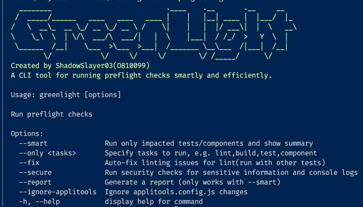

# **🟢 GreenLight CLI**

Smart preflight checker for lint, build, test, and component validation — built for speed and precision.



## **✨ Features**

* ✅ Runs **lint**, **build**, **unit tests**, and **component tests** smartly  
* 📂 Detects **impacted files** based on Git diffs  
* 🚀 Optimized for **CI** and **pre-push hooks**  
* 📊 Generates markdown reports  
* 🧠 Smart targeting of Cypress component tests  
* 🔐 No org needed — works for solo and team developers

## **📦 Installation**

npm install \-g greenlight

## **🚀 Usage**

Run all preflight checks:

```bash

greenlight \--smart

```

Only run specific checks:

```bash

greenlight \--only lint  
greenlight \--only build  
greenlight \--only test  
greenlight \--only component

```

Multiple:

```bash

greenlight \--only lint,test

```

## **💡 Example Workflow**

Add to a Husky pre-push hook:

```bash

\#\!/bin/sh  
\# Return early if we’re in Jenkins  
\[ \-n "$JENKINS\_URL" \] && exit 0

. "$(dirname "$0")/\_/husky.sh"

\# Redirect stdout/stderr for Windows compatibility  
if \[ \-t 2 \]; then  
  exec \>/dev/tty 2\>&1  
fi

echo "🟢 Running GreenLight Smart Pre-Push Checks..."

\# Run greenlight with smart detection  
npx greenlight \--smart \--secure \--report

STATUS=$?  
if \[ $STATUS \-ne 0 \]; then  
  echo "🔴 GreenLight check failed. Push aborted."  
  exit 1  
fi

echo "✅ All pre-push checks passed. Proceeding with push."  
exit 0

```

## **📁 Project Structure**

```bash

greenlight/  
├── bin/  
│   └── greenlight.js          \# CLI entry  
├── core/  
│   ├── dependencyGraph.js  
│   ├── impactAnalyzer.js  
│   ├── mdReportGenerator.js  
│   ├── reporter.js  
│   ├── runChecks.js  
│   ├── securityChecks.js  
│   └── updateCypressTargets.js  
└── package.json

```

## **🙌 Note **

This project is maintained by ShadowSlayer03. Please feel free to open a new issue or submit a pull request on the repository. For direct inquiries, you can reach out at sslayer441@gmail.com.

If you find this tool helpful, please consider giving it a star on GitHub\!